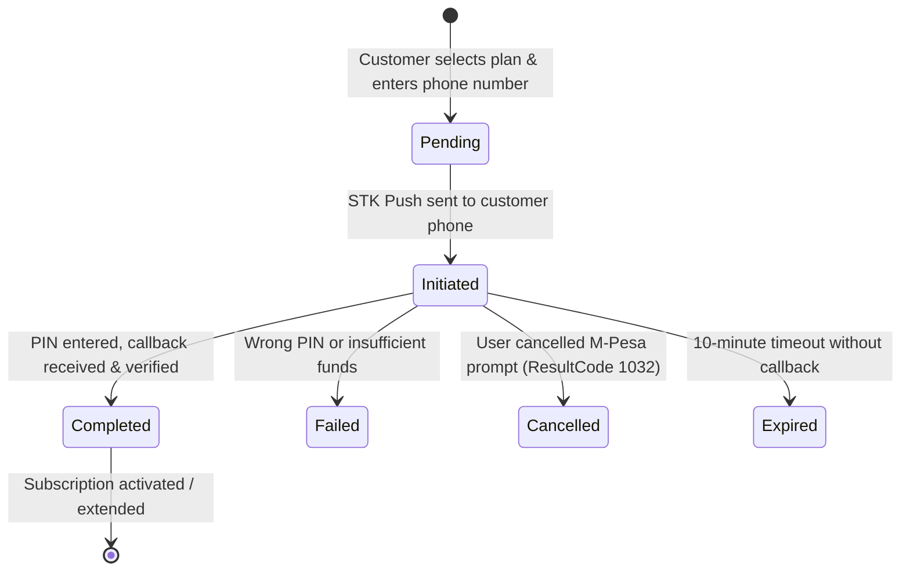

# Benchero Billing & Subscription Architecture

## 1. Executive Summary
Benchero features a production-grade, multi-tenant billing engine designed specifically for sports clubs and organization management. Subscriptions operate at the organization level (`organization_id`), governing platform access, public website visibility, media upload quotas, custom domains, and premium features.

Payment collection is powered by automated Safaricom M-Pesa STK Push integrated with I&M Bank.

---

## 2. Core Subscription Tiers
Defined centrally in the `plans` table:

1. **Free Trial (`free-trial`, ID: 1)**
   - **Price**: KSh 0.00
   - **Duration**: 14 Days (configured via `TRIAL_DURATION_DAYS=14`)
   - **Access**: Full feature trial for new clubs. Public club profile is visible.

2. **Standard Monthly (`standard-monthly`, ID: 2)**
   - **Price**: KSh 1,000.00 / month
   - **Features**: Essential club management, team limits (10), player limits (100), fixtures (500), public club website.

3. **Standard Yearly (`standard-yearly`, ID: 3)**
   - **Price**: KSh 10,000.00 / year (Save KSh 2,000)
   - **Features**: Full year club management, team limits (25), player limits (500), fixtures (2000), public club website.

4. **Benchero Pro (`benchero-pro`, ID: 4)**
   - **Price**: KSh 20,000.00 / year
   - **Features**:
     - Custom Domain connection (`www.myclub.co.ke`)
     - Controlled Video Uploads (2 GB video storage capacity)
     - Expanded Club Media Center (5 GB total media capacity)
     - Digital Club Card & QR Codes
     - Data Exporting (CSV / JSON format)
     - Custom OG Social Media Sharing images
     - Additional Club Admins & Priority Support
     - Removal of Benchero branding from public club website

---

## 3. Database Schema

### `plans`
- Stores platform-level plan metadata, prices in KES, billing intervals, and feature JSON configurations.

### `subscriptions`
- Maintains the active commercial agreement for an organization.
- Statuses: `trialing`, `active`, `expired`, `canceled`, `past_due`.
- Expiry date is tracked via `expires_at`. When `expires_at <= NOW()`, the subscription automatically transitions to `EXPIRED` status, hiding the public club profile until renewed.

### `payment_intents`
- Explicit payment lifecycle state machine: `pending` → `initiated` → `completed` | `failed` | `cancelled` | `expired`.
- Stores `organization_id`, `user_id`, `plan_id`, server-verified `amount`, `phone_number`, `provider_reference`, and `result_code`.

### `payments`
- Immutable financial ledger table for audit trails.
- Enforces a `UNIQUE` constraint on `provider_reference` / `mpesa_receipt_number` to guarantee idempotency and prevent double-crediting.

---

## 4. Payment Intent State Machine

---

## 5. Security & Financial Integrity
1. **Server-Side Pricing**: Prices are looked up strictly from server-side configuration/database based on `plan_id`. Amount parameters sent by the browser are discarded to prevent price tampering.
2. **Kenyan Phone Normalization**: Phone numbers are validated and sanitized into `2547XXXXXXXX` or `2541XXXXXXXX` 12-digit format.
3. **Idempotency & Replay Protection**:
   - Callbacks for an already `completed` payment intent return success without re-extending the subscription.
   - Unique constraints on payment receipt numbers prevent duplicate ledger entries.
4. **No PIN Storage**: M-Pesa PINs are entered directly into Safaricom's SIM tool/STK prompt on the user's mobile device and are never transmitted to or handled by Benchero.
5. **Tenant Isolation**: All payment intents and subscription queries verify `$tenant['id']` ownership derived from authenticated session tokens and route context.

---

## 6. Renewal & Extension Stacking
- **Active Subscription Renewal**: If an organization renews the *same* active plan before expiration, the new duration (+30 days for monthly, +1 year for yearly) is stacked onto the existing `expires_at` date.
- **Expired / Upgraded Subscription**: If the subscription is expired or the customer upgrades to a higher tier, the new term starts immediately from `NOW()`.

---

## 7. Administrative Reconciliation Dashboard
Platform Super Admins can review all payment intent history, filter transactions by status (`all`, `pending`, `completed`, `failed`, `cancelled`, `expired`), view revenue totals, and perform manual reconciliation with auditable logging via `/admin/payments`.
