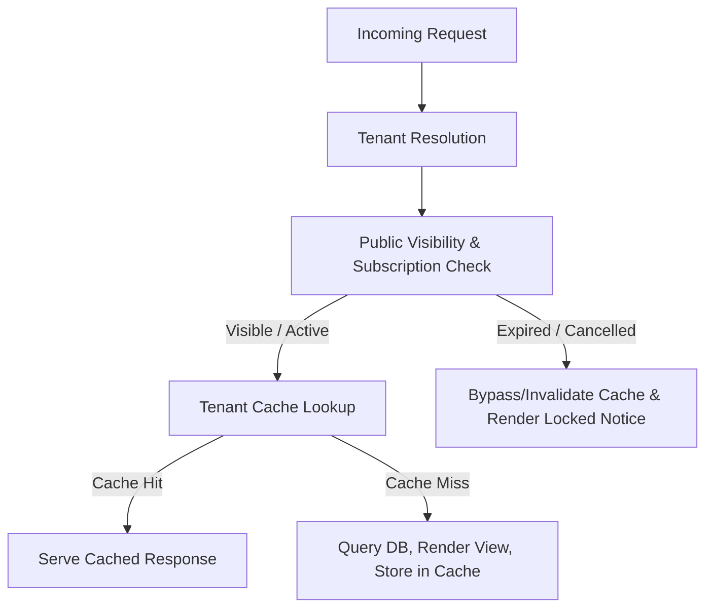

# BENCHERO — Cache Strategy & Tenant Isolation Specification

**Application:** Benchero SaaS  
**Domain:** `https://benchero.co.ke`  

---

## 1. Overview

Benchero employs a multi-tiered caching strategy designed to maximize response speed while strictly preventing cross-tenant data leaks or stale cached states on expired subscriptions.

---

## 2. Mandatory Execution Order

Every incoming public request evaluates through the following mandatory sequence:

1. **Request:** Incoming HTTP request received.
2. **Tenant Resolution:** Organization identified via domain or slug URL mapping.
3. **Public Visibility & Subscription Check:** `SubscriptionService->isPublicProfileVisible($orgId)` checks trial or active subscription expiration status.
4. **Cache Lookup:** Executed ONLY if public visibility is valid (`true`). If subscription is expired or cancelled, cache is bypassed and any existing stale cache for the tenant is invalidated.

---

## 3. Cache Keys & Tenant Isolation

To prevent Organization A's data from appearing on Organization B's site, all cache keys MUST be scoped with `organization_id`:

- `public_club:{organization_id}:home`
- `public_club:{organization_id}:about`
- `public_club:{organization_id}:teams`
- `public_club:{organization_id}:players`
- `public_club:{organization_id}:fixtures`
- `public_club:{organization_id}:results`
- `public_club:{organization_id}:standings`
- `public_club:{organization_id}:news`
- `public_club:{organization_id}:gallery`

---

## 4. Invalidation Triggers

`CacheService->flushOrgCache($orgId)` is invoked whenever any of the following mutations occur:

- Club profile & branding updates (logo upload, colors, description, contact details)
- Website theme or navigation customization
- Team creation, modification, or deletion
- Player profile updates or roster assignment changes
- Staff & technical bench updates
- Match fixture creation or result entries
- News article posts/updates
- Gallery photo uploads
- Sponsor additions or modifications
- Subscription activation, renewal, or expiration events
